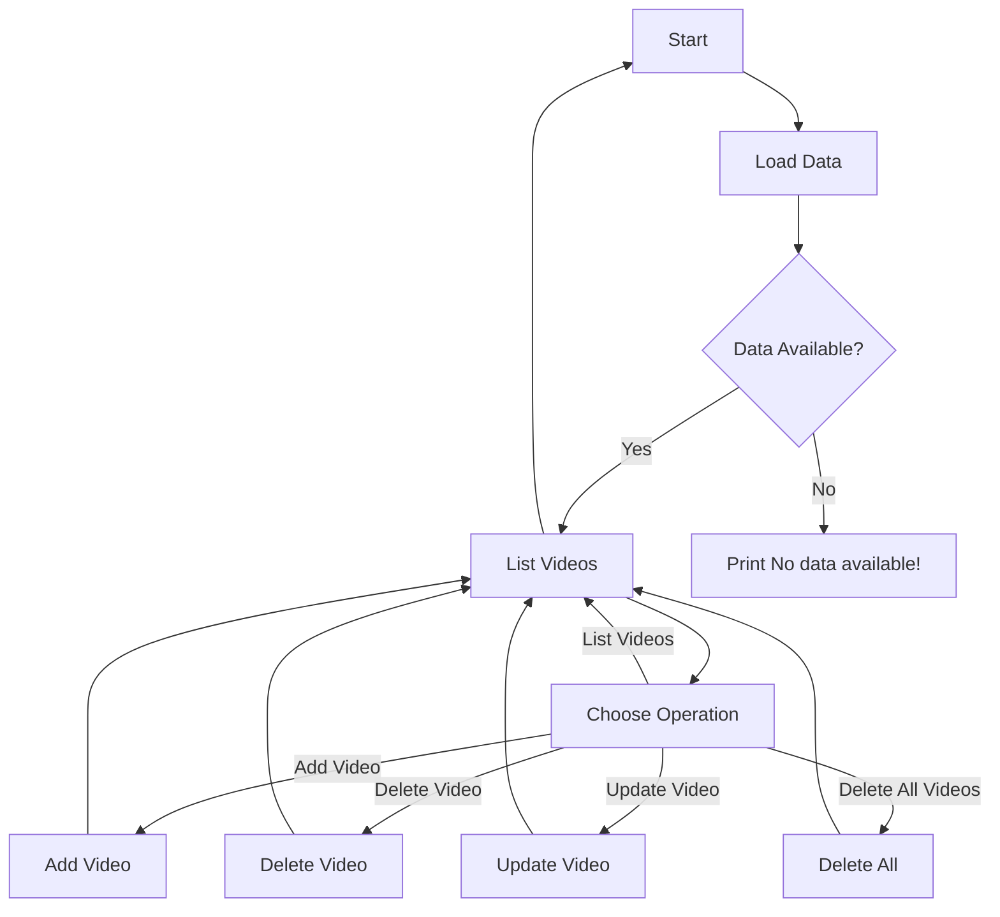

# 📍 YouTube Video Manager (PYTHON)

This is a CRUD (Create, Read, Update, Delete) application designed to manage YouTube video data. It allows users to perform various operations such as listing all YouTube videos, adding new videos, deleting existing videos, updating video details, and even deleting all videos in one go.

  

## ⚒️ How it Works

1. **List all YouTube videos**: This option displays a list of all the YouTube videos currently stored in the application.

2. **Add a YouTube video**: Users can add new YouTube videos by providing the title and duration of the video.

3. **Delete a YouTube video**: This option allows users to delete a specific YouTube video by selecting its index from the displayed list.

4. **Update a YouTube video**: Users can update the details of a specific YouTube video, including its title and duration.

5. **Delete all videos**: This option clears all the stored YouTube video data.

6. **Exit the app**: Terminates the application.

## ⭐ Functionality

- **Loading and Saving Data**: The application loads video data from a JSON file (`videos_data.json`) when launched and saves any changes made by the user back to the same file.

- **Exception Handling**: The application handles possible exceptions such as file not found errors when attempting to load data.

## 🔶 Flow Diagram

## Notes:

- **Modern Color Scheme**: The diagram uses modern colors to enhance visual appeal and clarity.
- **Handling Exceptions**: The application handles critical exceptions gracefully to ensure smooth operation.
- **File Handling**: Video data is stored and retrieved from a JSON file (`videos_data.json`). If the file doesn't exist, an empty list is provided.

## Function Details

- **`file_opener(file_name, open_in_mode)`:** This function opens a file with the specified mode. It returns the file content if the file exists, or an empty list if the file is not found.

- **`load_data(data_json_file)`:** Loads data from the JSON file and returns it as a Python object.

- **`save_data(data_want_to_save, file_to_save_data)`:** Saves the provided data to the specified JSON file.

- **`list_videos(videos)`:** Lists all YouTube videos. If no videos are available, it prints a message indicating so.

- **`add_video(videos)`:** Adds a new YouTube video to the list.

- **`delete_video(videos)`:** Deletes a specific YouTube video from the list.

- **`update_video(videos)`:** Updates the details of a specific YouTube video.

- **`delete_all(videos)`:** Deletes all YouTube videos from the list after user confirmation.

- **`main()`:** The main function of the application, which manages the user interface and handles user input.

## Connect with me

- [LinkedIn](https://linkedin.com/in/asif-shahzad-833435280)
